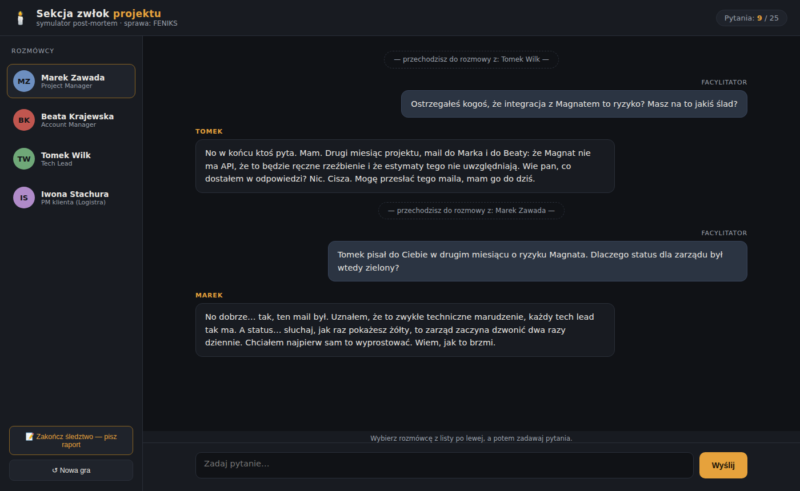

# Sekcja zwłok projektu

Narracyjna gra edukacyjna: wcielasz się w facylitatora post-mortem i przesłuchujesz AI odgrywające członków upadłego projektu. Uczy analizy przyczyn źródłowych, pytań otwartych i odróżniania faktów od narracji.



## Struktura repozytorium

- `sekcja-zwlok.html` — gra (jeden plik, zero backendu). Obsługiwane silniki AI: Anthropic, OpenAI, GLM/Zhipu, DeepSeek, Groq (Llama) oraz lokalne: LM Studio, Ollama, llama.cpp i dowolny endpoint OpenAI-compatible. Ranking z autoryzacją mailową (tryb demo bez backendu), regulamin i polityka prywatności wbudowane.
- `ranking-server.js` — backend rankingu i pojedynków (Node.js + express + nodemailer): kody na email, maskowanie adresów (3 pierwsze + 3 ostatnie znaki), leaderboard, wyzwania. Konfiguracja w komentarzu na górze pliku.
- `test/` — testy `node:test` (bez zależności zewnętrznych): `npm test`.
- `docs/superpowers/specs/` — zatwierdzone specyfikacje funkcji.
- `system-prompt.md` — pełny prompt jednoplikowy (scenariusz FENIKS) do wklejenia w dowolny czat LLM.
- `gpt/` — pakiet Custom GPT: `gpt-master-prompt.md` (Instructions, <8000 znaków) + 6 scenariuszy, talia modyfikatorów losowych i szablon scenariusza (pliki wiedzy).
- `img/` — grafiki w stylu polskiego komiksu kryminalnego lat 70. (opis niżej).
- `prompty-grafiki.md` — prompty do generatorów obrazu użyte do stworzenia grafik.
- `koncept.md` — pełny koncept narzędzia (mechanika, analiza wartości, wnioski z iteracji, plan screencastu).
- `deck.js` + `sekcja-zwlok-prezentacja.pptx` — generator i gotowa prezentacja konceptu.

## Grafiki

| Ścieżka | Zawartość |
|---|---|
| `img/marek.png`, `beata.png`, `tomek.png`, `iwona.png` | Portrety czwórki przesłuchiwanych, 384×384. Gra podmienia nimi inicjały w panelu „Rozmówcy"; jeśli pliku brak, `onerror` cofa avatar do inicjałów. |
| `img/emocje/<postać>-<emocja>.jpg` | 20 wariantów mimiki, 768×768. Emocje: `radosc`, `zlosc`, `zaskoczenie`, `smutek`, `rezygnacja`. Wariant neutralny to portret główny z wiersza wyżej. Podmieniane w trakcie gry — patrz niżej. |
| `img/okladka.jpg` | Okładka „FENIKS — gra śledcza", 2:3. |
| `img/tlo-debriefu.jpg` | Ściana dowodów z czerwonymi sznurkami, 16:9. |

Grafiki w repozytorium są przeskalowane pod web. Oryginały 1254×1254 nie są wersjonowane — raster halftone kompresuje się fatalnie w PNG (~3,3 MB na plik).

## Szybki start

Otwórz `sekcja-zwlok.html` w przeglądarce, wybierz silnik AI, wklej klucz (lub uruchom lokalny serwer modelu) i kliknij „Rozpocznij śledztwo".

Ranking ogólny: uruchom `ranking-server.js` i ustaw `RANKING_API` na początku skryptu w `sekcja-zwlok.html`.

```
npm install
SMTP_HOST=smtp.example.com SMTP_PORT=587 SMTP_USER=... SMTP_PASS=... \
MAIL_FROM="Sekcja Zwłok <ranking@example.com>" \
GAME_URL="https://twoja-domena/sekcja-zwlok.html" CHALLENGE_SALT="losowy-ciag" \
PORT=3001 npm start
```

Bez zmiennych SMTP serwer działa w trybie deweloperskim: treść maili i gotowe linki lądują na konsoli zamiast w skrzynkach. Pozwala to przejść cały przepływ lokalnie, łącznie z pojedynkiem, bez wysyłania czegokolwiek.

Dane trzyma SQLite (`node:sqlite` — wbudowany w Node 22+, bez zależności natywnych) w pliku `ranking.db` obok serwera. Plik jest celowo wykluczony z repozytorium: zawiera pełne adresy e-mail graczy. Kody autoryzacyjne, bilety i liczniki limitów też siedzą w bazie, więc **restart serwera nie kasuje aktywnych kodów ani nie resetuje ochrony przed spamem**.

Jeśli obok serwera leży `ranking-data.json` z poprzedniej wersji, przy pierwszym starcie zostaje przepisany do bazy i zmieniony na `ranking-data.json.migrated`. Operacja jest jednorazowa (warunek: pusta baza) i nieniszcząca — oryginał zostaje na dysku.

| Zmienna | Rola |
|---|---|
| `SMTP_*`, `MAIL_FROM` | Wysyłka maili. Brak = tryb deweloperski (konsola). |
| `GAME_URL` | Adres, pod którym stoi gra — potrzebny do zbudowania linku w zaproszeniu. **Brak wyłącza pojedynki.** |
| `CHALLENGE_SALT` | Sól do skrótów adresów przy limitowaniu zaproszeń. Brak = losowa przy starcie (limity resetują się po restarcie). |
| `CORS_ORIGIN` | Ograniczenie źródła żądań. Domyślnie `*`. |
| `DB_FILE` | Ścieżka bazy SQLite. Domyślnie `ranking.db` obok skryptu. |
| `DATA_FILE` | Ścieżka starego pliku JSON do jednorazowej migracji. Domyślnie `ranking-data.json`. |

## Emocje rozmówców

Przy każdej wypowiedzi w czacie pojawia się portret pokazujący, w jakim stanie jest postać w tej chwili — a portret w panelu bocznym odzwierciedla stan bieżący. Emocja przy dymku zostaje **zamrożona**, więc przewijając rozmowę widać przebieg przesłuchania: moment, w którym ktoś przestał się uśmiechać.

Emocji nie wybiera model. Wynika ona z **kształtu przesłuchania**, bo przeglądarka nie wie, co w scenariuszu jest prawdą — ta wiedza należy do modelu. Cztery obserwowalne sygnały składają się na napięcie liczone osobno dla każdej postaci:

| Sygnał | Wpływ |
|---|---|
| Nacisk — kolejne pytania pod rząd do tej samej osoby | rośnie z każdym pytaniem |
| Konfrontacja — w pytaniu pada imię innego rozmówcy | skok napięcia i wymuszone zaskoczenie na tę odpowiedź |
| Zegar śledztwa — postęp do 25 pytań | podnosi napięcie wszystkim |
| Powrót do porzuconego rozmówcy | dokłada, gdy wracasz po co najmniej dwóch pytaniach do innych |

Pytanie zadane komu innemu pozwala postaci ostygnąć.

Ta sama presja daje **inną minę u każdej postaci**, zależnie od jej strategii obronnej: Marek (unika) idzie w smutek → zaskoczenie → rezygnację, Beata (czaruje) w radość → zaskoczenie → złość, Tomek (zgorzkniały) w radość → złość → rezygnację, Iwona (zmęczona) w smutek → rezygnację → złość. Mimika jest więc informacją zwrotną o jakości pytań, a nie ozdobnikiem.

Logika siedzi w bloku `// <emocje>` … `// </emocje>` w `sekcja-zwlok.html` — czyste funkcje bez DOM. Testy (`test/emocje.test.js`) wycinają ten blok z HTML-a i wykonują w izolacji, dzięki czemu gra zostaje jednym plikiem, a logika ma prawdziwe testy jednostkowe.

## Pojedynki

Gracz, który zapisał wynik w rankingu, może wyzwać znajomego: po zapisie modal proponuje wysłanie zaproszenia. Wyzwany dostaje link, gra ten sam scenariusz i po debriefie odpowiada — anonimowo albo przy okazji zapisując wynik w rankingu ogólnym. Wyzywający dostaje powiadomienie o rozstrzygnięciu.

Zasady, które warto znać przed uruchomieniem publicznie:

- **Adres osoby wyzwanej nie jest nigdzie zapisywany.** Rekord pojedynku zawiera wyłącznie adres wyzywającego — ten, który jest już w rankingu za zgodą. Limit zaproszeń na jeden adres działa na nieodwracalnym skrócie z solą.
- **Treść zaproszenia to sztywny szablon.** Nie ma pola na wolny tekst, a nick pobierany jest z bazy rankingu, nie z żądania — mail może więc zawierać tylko to, co nadawca już opublikował publicznie pod zweryfikowanym adresem.
- **Limity:** 5 zaproszeń na dobę od jednego gracza, 2 na dobę na jeden adres docelowy niezależnie od nadawcy. Linki wygasają po 14 dniach, na jedno wyzwanie przypada jedna odpowiedź.

Projekt funkcji: [`docs/superpowers/specs/2026-08-12-pojedynek-wyzwanie-design.md`](docs/superpowers/specs/2026-08-12-pojedynek-wyzwanie-design.md).

## Licencja

MIT — patrz [LICENSE](LICENSE).
